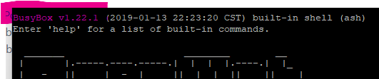

# 1. Physical connection
- Connect the UART interface to a connector (see (UART)[UART.md]).
- Start Putty (or other serial consoles)
- Create a Connection-Settings described in (UART)[UART.md]
- Start the Session of the Connection
- Start the target device (power-button)
- Wait until the device is fully booted

# 2. Login
See (Login)[Login.md].

# 3. Update Busybox
### 1. Check Version


### 2. Check the File-Size
Type `ls -lha /bin/busybox` to get the filesize of the old version:

```tty
-rwxr-xr-x    1 e-ruike  root      417.3K Jan 13  2019 /bin/busybox
```

You know: the size of Busybox is `417.3 KB`.

### 3. Check the System
Type simply `uname -a`:

```
Linux E-RUIKE 3.10.14 #56 Tue May 7 10:54:03 CST 2019 mips GNU/Linux
```

You know: the Target is `mips`.

Check also `cat /roc/cpuinfo` for more details:

```
system type             : MT7628
machine                 : Unknown
processor               : 0
cp model                : MIPS 24KEc V5.5
BogoMIPS                : 382.46
wait instruction        : yes
microsecond timers      : yes
tlb_entries             : 32
extra interrupt vector  : yes
hardware watchpoint     : yes, count: 4, address/irw mask: [0x0ffc, 0x0ffc, 0x0ffb, 0x0ffb]
isa                     : mips1 mips2 mips32r1 mips32r2
ASEs implemented        : mips16 dsp
shadow register sets    : 1
kscratch registers      : 0
core                    : 0
VCED exceptions         : not available
VCEI exceptions         : not available
```

### 4. Download new Version
Go to [https://busybox.net/downloads/binaries/](https://busybox.net/downloads/binaries/), select your version what you like (we use the latest multiarch-Version of `1.31.0`) and find the target-version for `mips`:

[1.31.0-defconfig-multiarch-musl/busybox-mips](https://busybox.net/downloads/binaries/1.31.0-defconfig-multiarch-musl/busybox-mips)

Download it over windows (possible with `wget`) and store it on your local webserver of your main computer:
```
wget https://busybox.net/downloads/binaries/1.31.0-defconfig-multiarch-musl/busybox-mips -O C:/xampp/htdocs/busybox-new
```

> [!NOTE]
> We use a local Webserver (for sample with Xampp) because old versions of Busybox cant handle `HTTPS` connections. We need a simple `HTTP`-Server.

### 5. Upload Busybox to 
Go into your Serial-Console and download your `busybox-new` from your local webserver:
> wget http://192.168.0.32/busybox-new -O /root/busybox-new
```
Connecting to 192.168.0.32 (192.168.0.32:80)
busybox-new          100% |*******************************|  1590k  0:00:00 ETA
```

### 6. Test the new Version
Change the permissions of Busybox:
```
chmod +x /root/busybox-new
```

Move the binary as symbolic link to Binary folder:
``` 
ln -s /root/busybox-new /bin/busybox-new
```

And type:
```
busybox-new
```