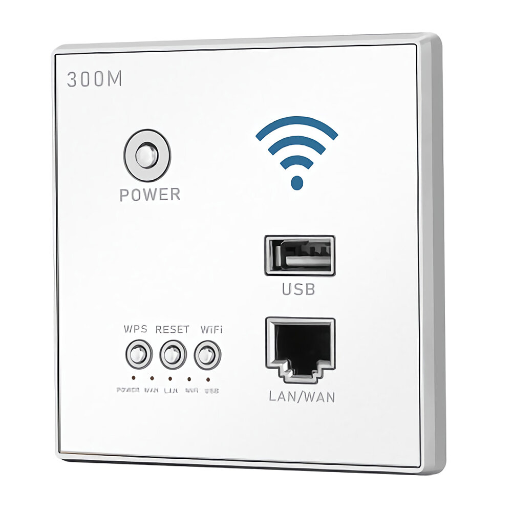

# YTXC-958K
China WiFi-Router

 

## Produkt informations
This product is a wireless router that is permanently installed on the wall in conjunction with a standard wall switch socket. It is suitable for wireless wireless network coverage in modern homes and hotels, enterprises, schools, small office areas and other places. This product integrates wireless routing, PPPoE dial-up Internet access, USB charging, wireless relay, wireless AP and other functions into one. It has powerful functions, stable performance, convenient installation, simple settings and beautiful appearance.

## Possible Manufacturer
- Outenga
- Bcsongben
- Wallpad
- Waizmann

## Hardware
- **CPU:** Mediatek MT7628NN (580 MHz)
- **RAM:** 64 MB
- **Storage:** 8 MB Flash
- 1x USB 2.0 Port (Front)
- 1x 100 Mbit LAN (Front)
- 1x 100 Mbit LAN (Back)
- 2.4 Ghz WiFi (with 2 internal antennas)
- **OS:** OpenWrt Linux/Ubuntu

## Functional features
- Integrate into the wall and provide a luxurious appearance.
- Hidden reset button, more secure and reliable.
- Support LAND output, wired and wireless networks can be selected at will.
- Directly connected to 110-240V AC power, no additional power adapter required.
- Built-in omnidirectional independent intelligent high-gain antenna, super strong signal, wider coverage and stronger penetration.
- The practical mid-burn function can reduce signal-blind areas, increase wireless range and save a lot of network wiring.
- The 5V-1500mA USB power output enables fast charging of most cell phones, tablets and other devices (only certain models have this function).
- With the phone line interface, one device can do many things (only certain models have this function).

> [!CAUTION]
> Warning: The power provided by the USB interface is only used to charge battery-powered devices, other loads must not be used, otherwise it may cause damage to the device and the manufacturer will not bear any consequences.

# Great Tutorials
 [Finding UART and Getting a Root Shell on a Linux Router](https://www.youtube.com/watch?v=HWJddAd2T5Q)
